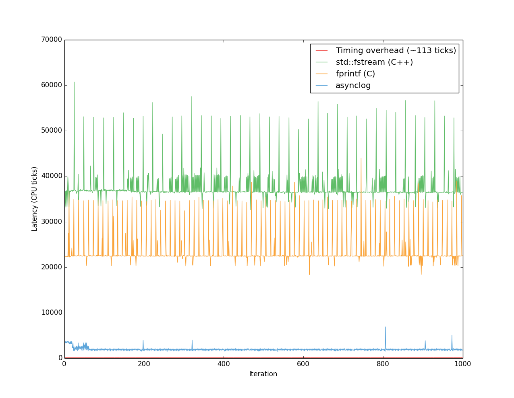

Introduction
------------
Asynclog is an extremely low-latency, lightweight logging library. It
was created because I needed to perform extensive diagnostic logging
without worrying about performance. [Other logging
libraries](http://www.pantheios.org/performance.html) boast the ability
to throw log messages away very quickly; asynclog boasts the ability to
keep them all, without worrying about the performance impact. Filtering
can wait until you want to read the log, or need to clean up disk space.

By low latency, I mean that the time between your call to the library
and its return to you is as low as I could make it. Only the minimum
required work is performed during the call. The rest is performed in a
separate thread. This has some good and some bad sides, which I'll get
into later.

Performance
-----------

Why is it so fast?
------------------

Only the
bare minimum of work is performed, which is to save the arguments on a
lockless queue and return. The remainder of the work, i.e. string
formatting and disk i/o is performed on a separate thread. Apart from
not having to wait for the actual I/O operation (or more likely, copying
the data to the OS cache) to complete, this has three advantages:

1. It avoids costly calls to the kernel. Even an ordinary queue with
   mutex locks are expensive because of the cost associated with
   switching CPU context to privileged mode.
2. It doesn't slow down the rest of your code. Calling the OS kernel is
   likely to severely pollute your CPU cache, evicting the data you were
   working on to RAM. In other words, *it makes your non-logging code
   run faster* than if you were using a logging library that has to
   enter the kernel to perform its work.
3. 

The idea is to
just keep the logging arguments on a queue

What's the catch?
-----------------
