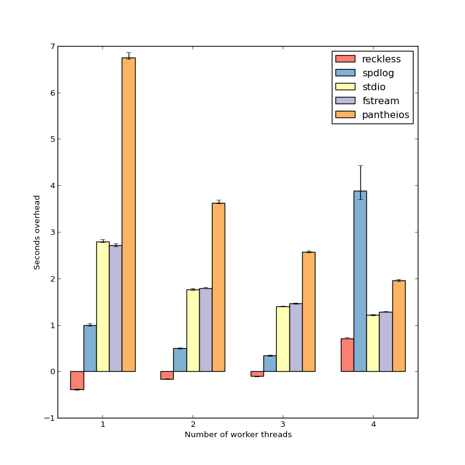

[](doc/performance.md)

Introduction
============
Reckless is an [extremely low-latency, high-throughput logging
library](doc/performance.md). It was created because I needed to perform
extensive diagnostic logging without worrying about performance. [Other
logging libraries](http://www.pantheios.org/performance.html) boast the
ability to throw log messages away very quickly. Reckless boasts the ability
to keep them all, without worrying about the performance impact. Filtering can
and should wait until you want to read the log, or need to clean up disk
space.

How it works
============
By low latency I mean that the time from calling the library and
returning to the caller is as short as I could make it. The code
generated at the call site consists only of pushing the arguments on a
shared, lockless queue. In the non-contended case this has roughly the
same cost as a making a function call. The actual message formatting
and writing is performed asynchronously by a separate thread. This
removes or hides several costs:

* No transition to the kernel at the call site. The kernel is an easily
  overlooked but important cost, not only because the transition costs
  time, but because it pollutes the CPU cache. In other words, avoiding
  this *makes your non-logging code run faster* than if you were using a
  library that has to enter the kernel to perform its work.
* No locks need to be taken for synchronization between threads (unless
  the queue fills up; see the performance article for more information
  about the implications of this).
* No text formatting needs to be performed before resuming the main
  task of the program.
* It doesn't have to wait for the actual I/O operation to complete.
* If there are bursts of log calls, multiple items on the queue can be
  batched into a single I/O operation, improving throughput without sacrificing
  write latency.

For a more detailed performance discussion and statistics, see the
[performance article](doc/performance.md).

What's the catch?
=================
As all string formatting and I/O is done asynchronously and in a single
thread, there are a few caveats you need to be aware of:
* If you choose to pass log arguments by reference or pointer, then you
  must ensure that the referenced data remains valid at least until the
  log has been flushed or closed (unless you're only interested in
  logging the value of the pointer itself). The best option for
  dynamically allocated data is typically `std::string`,
  `std::shared_ptr` or `std::unique_ptr`.
* You must take special care to handle crashes if you want to make sure
  that all log data prior to the crash is saved. This is not unique to
  asynchronous logging&mdash;for example fprintf will buffer data until you
  flush it&mdash;but asynchronous logging arguably makes the issue worse. The
  library provides convenience functions to aid with this.
* As all string formatting is done in a single thread, it could
  theoretically limit the scalability of your application if
  formatting is expensive or your program generates a high volume of
  log entries in parallel.
* Performance becomes somewhat less predictable and harder to measure. Rather
  than putting the cost of the logging on the thread that calls the logging
  library, the OS may suspend some other thread to make room for the logging
  thread to run.

Basic use
=========
```c++
#include <reckless/severity_log.hpp>
#include <reckless/file_writer.hpp>

// It is possible to build custom loggers for various ways of formatting the
// log. The severity log is a stock policy-based logger that allows you to
// configure fields that should be put on each line, including a severity
// marker for debug/info/warning/error.
using log_t = reckless::severity_log<
    reckless::indent<4>,       // 4 spaces of indent
    ' ',                       // Field separator
    reckless::severity_field,  // Show severity marker (D/I/W/E) first
    reckless::timestamp_field  // Then timestamp field
    >;

reckless::file_writer writer("log.txt");
log_t g_log(&writer);

int main()
{
    std::string s("Hello World!");

    // You can use ordinary printf-style syntax, but unlike stdio this
    // is type-safe and extensible.
    g_log.debug("Pointer: %p", s.c_str());
    g_log.info("Info line: %s", s);

    for(int i=0; i!=4; ++i) {
        reckless::scoped_indent indent;  // The indent object causes the lines
        g_log.warn("Warning: %d", i);    // within this scope to be indented.
    }

    g_log.error("Error: %f", 3.14);

    return 0;
}
```
This would give the following output:
```
D 2019-03-09 12:53:54.280 Pointer: 0x7fff58378850
I 2019-03-09 12:53:54.280 Info line: Hello World!
W 2019-03-09 12:53:54.280     Warning: 0
W 2019-03-09 12:53:54.280     Warning: 1
W 2019-03-09 12:53:54.280     Warning: 2
W 2019-03-09 12:53:54.280     Warning: 3
E 2019-03-09 12:53:54.280 Error: 3.140000
```

Platforms
=========
The library works on Windows and Linux. BSD is on the roadmap. I don't
own any Apple computers, so OS X won't happen unless someone sends me
a patch or buys me hardware.

Building
========

Alternative 1: Using Visual Studio
----------------------------------
On Windows it is recommended to use Visual Studio for building the library.
Simply open reckless.sln, choose "batch build" and "select all". Then press Build.
The library files will be placed in the `build` subdirectory.

To build a program against the library you need to set your library path to
point to the appropriate library build for your configuration, and set the
include path to `$(RECKLESS)/reckless/include`, where `RECKLESS`, given that
RECKLESS is a property that points to the reckless source directory.

Alternative 2: using Make
-------------------------
To build the library using GNU Make, clone the git repository and run make.
This only works with GCC-compatible compilers.

To build a program against the library, given the variable RECKLESS
pointing to the reckless root directory, use e.g.:

```bash
g++ -std=c++11 myprogram.cpp -I$(RECKLESS)/reckless/include -L$(RECKLESS)/reckless/lib -lreckless -lpthread
```

Alternative 3: using CMake
--------------------------
To build the library using CMake, clone the git repository and run the following commands:

```
mkdir build; cd build
cmake ..
make
```

To build a program against this library using CMake, add the following line to your program's CMakeLists.txt:

```
add_subdirectory(path/to/reckless)
```

Subsequently, to link this library to a program (e.g. *your_executable*), add the following to your program's CMakeLists.txt:

```
target_link_libraries(your_executable reckless pthread)
```

More information
================
For more details, see the [manual](doc/manual.md).

Alternatives
============
Other logging libraries with similar, asynchronous design are
* [spdlog](https://github.com/gabime/spdlog/)
* [g3log](https://github.com/KjellKod/g3log/)
* [NanoLog](https://github.com/Iyengar111/NanoLog) (there is [another
  NanoLog](https://github.com/PlatformLab/NanoLog) which deviates in design
  since it logs binary data and requires postprocessing to read the log file)
* [mini-async-log](https://github.com/RafaGago/mini-async-log)
