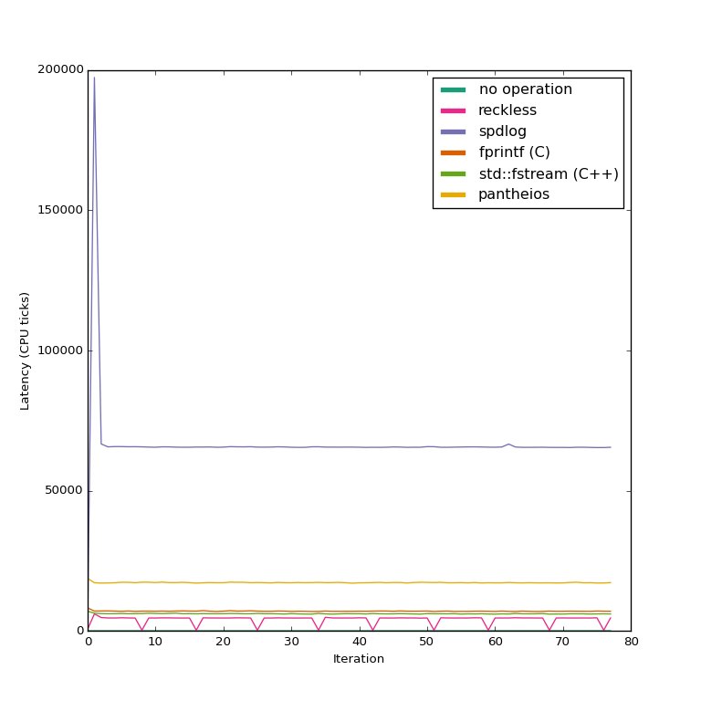
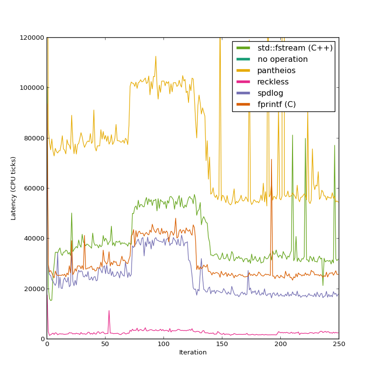
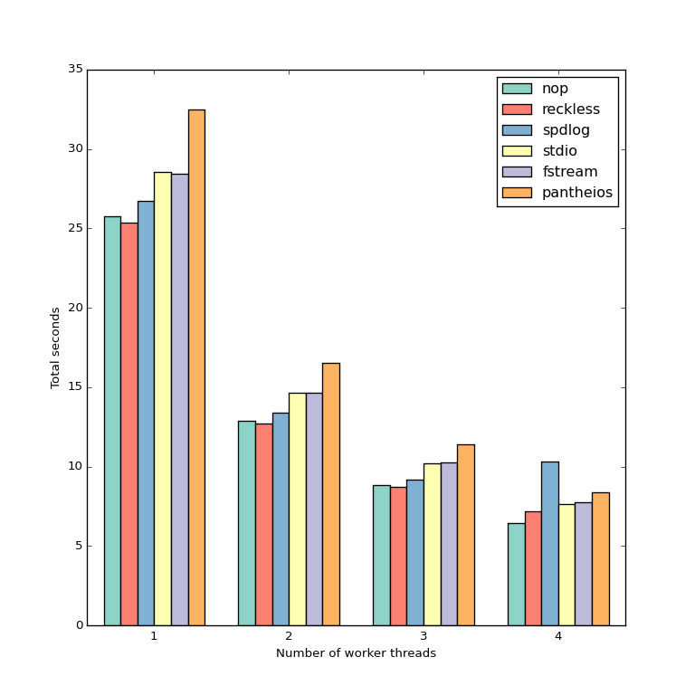

Benchmarks
==========

Libraries
---------
Apart from reckless, the libraries or logging techniques that are benchmarked
here are:
* fprintf. This uses the standard stdio string formatting and calls `fflush()`
  after each call.
* std::fstream. This uses an `std::fstream` object and streams `std::flush`
  after each log line.
* [spdlog](https://github.com/gabime/spdlog/) (version 1.3.1). This is close
  to reckless in its design goals. It tries to be very fast, and offers an
  asynchronous mode. See notes below on how it is used in the benchmark.
* [g3log](https://github.com/KjellKod/g3log) (version 1.3.2) is another
  asynchronous library that also offers "crash safety", i.e. a signal handler
  that can flush the log in the event of a crash (like reckless does).
* [Boost.Log](https://www.boost.org/doc/libs/1_69_0/libs/log/doc/html/index.html)
  (from Boost version 1.65.0) is generally seen as a serious alternative due
  to Boost's peer-review process and the resulting high esteem in the C++
  community. Unsurprisingly this is a "swiss army knife" with high abstraction
  level and multiple, pluggable log producers and sinks.
* No operation. This means that the log call is ignored and no code is
  generated apart from the timing code. For the scenarios that measure
  individual call timings, this gives us an idea of how much overhead is added
  by the measurement itself. For scenarios that measure total execution time,
  this lets us compare the execution time to what it is when logging occurs at
  all.

These benchmarks used to include Pantheios which is still often recommended as
a good library with high performance. However it [hasn't been possible to
build](https://github.com/synesissoftware/Pantheios/issues/3) for the past
several years so it doesn't seem like a realistic alternative at the present
time.

How to read the benchmarks
--------------------------
When you make claims about performance people expect that they are backed up
with measurements. But it is important to realize that your use case and
constraints can have a big impact on how performance is measured and,
consequently, what results you get. For example, reckless allows you to pass
raw pointers to the background thread even though they may no longer be valid
by the time they are written to disk. This can improve performance but can
lead to strange crashes if you make mistakes. The other logging libraries
prepare the log string at the call site, which avoids the risk of using a
dangling pointer but increases call latency. This is an intentional design
tradeoff, and no two alternatives can be compared without considering what
those tradeoffs are.

For reckless the following assumptions were made, and the benchmarks were
developed according to those assumptions:
* It is important to minimize the risk of losing log messages in the event of a
  crash.
* It is OK to [trade some precision in floating-point
  output](manual.md#limited-floating-point-accuracy) for added performance.
* We are concerned with the impact of actual logging, not of logging calls that
  are filtered out at runtime (say, debug messages that are disabled via some
  compile-time or run-time switch). We expect to produce many log messages in
  production environments and not just in debug mode. It is too late to enable
  log messages post-mortem.
* We care enough about performance that we will accept the risk for
  dangling pointer references. Note that I do not think this will be a problem
  in practice, but I still thought it is significant enough to at least point
  out. You should be OK as long as you never use a raw pointer to dynamically
  allocated or stack-allocated memory in your log call. Pointers to global
  objects are usually fine, and so are string literals. For dynamically
  allocated strings you should use e.g. `std::string`.

Another factor that I care about is that latency should be kept at a stable,
insignificant level. If the write buffer is very large then the user may
experience sudden hangs as the logger suddenly needs to flush large amounts of
data to disk. The buffer size in reckless is configurable and could be set
very large if desired, but the default size is 64 KiB. A reasonable
expectation is for a log entry to use 128 bytes, which would mean that such a
buffer would fit 512 log entries before stalling.

In the [benchmark made by the spdlog
author](https://github.com/gabime/spdlog/blob/bdfc7d2a5a4ad9cc1cebe1feb7e6fcc703840d71/bench/async_bench.cpp),
the asynchronous queue is at least 50 MiB in size, in order to fit all log
messages without having to flush. The measurement does not include log setup
and teardown.  In other words, it only measures time for pushing log entries
on the asynchronous queue and not the time for flushing all those messages to
disk. *This is fine*, if:

* You can afford a large enough memory buffer that it will never run out of
  space (but keep in mind that if you make it too large, disk swapping can
  occur and nullify your gains).
* Your process is long-running and you trust that the data will eventually get
  written to disk.
* It is OK to lose a large number of log messages in the event of a crash.

But since the constraints are different in this benchmark, the spdlog buffer
size was set to roughly 32 KiB (512 entries), and the file sink was put in
force-flush mode to ensure that messages are written early instead of being
kept around indefinitely in the stdio buffer. This corresponds to the behavior
of reckless, which flushes whenever it can. The main reason that the estimated
RAM usage for the reckless buffer is higher is that entries are aligned in
memory to the cache-line size. Actual memory usage is difficult to determine
accurately; spdlog might well have the same actual usage due to alignment of
queue entries in the memory allocator.

The [Pantheios performance article](http://www.pantheios.org/performance.html)
shows performance both when logging is turned on and off. It claims that
“Pantheios is 10-100+ times more efficient than any of the leading diagnostic
logging libraries currently in popular use.” I’m not sure that this can be
concluded from the charts at all, but in the event that it can, it applies
*only when logging is turned off*. For this benchmark I have only tested for
the case when logging is turned *on*. Again, the Pantheios developers have
clearly set different goals with their benchmarks than I do here.

On a similar notion, for stdio and fstream the file buffer is flushed after
each write. Note that in all libraries tested, flushing means sending the data
to the OS kernel, not actually writing to disk. Sending it to the kernel is
enough to ensure that the data will survive a software crash, but not an OS
crash or power loss.

The specifications of the test machine are as follows:
* AMD Ryzen 7 2700X CPU at 3.7 Ghz with 8 CPU cores. Simultaneous
  multithreading (the equivalent of what Intel calls hyper-threading) is
  turned off.
* Samsung 970 EVO 1TB M.2 solid-state disk.
* Western Digital Red WD30EFRX 3TB mechanical disk, mounted in a
  Synology DiskStation DS216j network-attached storage (for disk I/O-bound
  benchmark).
* 32 GiB RAM.
* gcc 7.3.0.
* Linux kernel 4.14.65.

For the scenarios that measure individual call timings, measurements were made
according to the article “[How to Benchmark Code Execution Times on Intel
IA-32 and IA-64 Instruction Set
Architectures](http://www.intel.com/content/www/us/en/intelligent-systems/embedded-systems-training/ia-32-ia-64-benchmark-code-execution-paper.html)”
by Gabriele Paoloni. To avoid risk of unsynchronized time-stamp counters
across CPU cores, each measured thread is forced to run on a specific CPU core
by setting the thread affinity.

For tests that only measure total execution time, `std::chrono::steady_clock`
is used.

Periodic calls
--------------

[benchmarks/periodic_calls.cpp](../benchmarks/periodic_calls.cpp)

In this scenario we simulate a single-threaded program that makes regular
calls to the log, but not so often that the buffer is anywhere near filling
up. Other than logging, the disk is not busy doing anything. It is the most
forgiving scenario, but probably also very common in interactive applications.

For the asynchronous libraries this involves only pushing log entries to a
queue without having to wait for any I/O, so we should expect that they
perform much better than the synchronous ones. But unfortunately this can't be
said for either spdlog or g3log. In the [previous
benchmark](images/performance_periodic_calls_all_old_spdlog.png) made in 2015,
spdlog performed much better. The benchmarking code has seen minor changes
since then but nothing that would explain the difference. A possible
explanation is that spdlog version 0.17 reportedly switched from a lockless
queue to a blocking queue, which would mean a higher latency (but less
variance). I have reached out to the authors of these libraries so they can
point out any errors in my measurement method or resolve issues in their
libraries if any.

If we zoom in on the reckless graph we get a better idea of the measurement
overhead and accuracy.

The average call latencies relative to reckless are as follows:

|  Library | Relative time |  IQR |
|----------|---------------|------|
|      nop |          0.45 | 0.27 |
| reckless |          1.00 | 1.08 |
|   spdlog |         40.85 | 7.28 |
|  fstream |         41.32 | 7.55 |
|    stdio |         43.77 | 7.28 |
|boost_log |         67.42 | 1.89 |
|    g3log |         78.19 | 4.65 |

Call burst
----------

[benchmarks/call_burst.cpp](../benchmarks/call_burst.cpp)

This scenario stresses the log by generating messages as fast as it can,
filling up the buffer. The plot is zoomed in so we can see data for all the
libraries. At first sight reckless and spdlog appear to perform well, but
there are now spikes that appear when the buffer fills up and the caller has
to wait for data to be written, effectively causing synchronous behavior.
These spikes in fact go as far as 80 000 ns (0.08 milliseconds) for reckless.
Depending on what input-buffer size you set the distance and height between
these spikes will vary. For this benchmark the queue size was set so that it
would fit 128 log entries. A larger queue size would take longer to fill up,
but once full the latency spike would be even higher.

By applying a moving average we get a better idea of the overall performance:

It can now be seen that reckless is still the best performer on average and
spdlog comes in second, but of all the libraries reckless has by far the
highest variance in this benchmark. The average latency is now 560
nanoseconds, compared to 40 nanoseconds in the previous test.

It should be noted that while reckless has been profiled and optimized to
handle this situation as gracefully as it can, it is far from an ideal
situation. In general, if your buffer fills up due to a sporadic burst of data
then you should consider enlarging the buffer. The API offers performance
counters to measure how often this happens.

The average call latencies relative to reckless are:

|  Library | Relative time |  IQR |
|----------|---------------|------|
|      nop |          0.03 | 0.02 |
| reckless |          1.00 | 0.02 |
|   spdlog |          1.93 | 1.08 |
|  fstream |          2.36 | 0.02 |
|    stdio |          2.55 | 0.02 |
|boost_log |          3.84 | 0.02 |
|    g3log |          4.20 | 1.79 |

Disk I/O
--------

[benchmarks/write_files.cpp](../benchmarks/write_files.cpp)

In this scenario the disk is put under load by interleaving the log calls with
heavy disk I/O. 2048 log entries are produced while writing 64 GiB of raw data
to a set of files. The synchronous alternatives suffer from latency spikes of up
to 7 seconds. Reckless can hide the latency by allowing logging to continue
while the writes are in progress, and then combining all outstanding writes into
a single I/O operation.

The average call latencies relative to reckless are:

|  Library | Relative time |  IQR |
|----------|---------------|------|
|      nop |          0.03 | 0.02 |
| reckless |          1.00 | 0.93 |
|    stdio |         17.01 | 3.68 |
|   spdlog |         23.82 | 2.13 |
|    g3log |         30.71 | 2.70 |
|boost_log |         46.03 | 1.40 |
|  fstream |       5719.93 | 4.50 |

Mandelbrot set
--------------

[benchmarks/benchmark_mandelbrot.cpp](../benchmarks/benchmark_mandelbrot.cpp)

[benchmarks/mandelbrot.cpp](../benchmarks/mandelbrot.cpp)

The mandelbrot scenario emulates a more realistic situation by performing a
CPU-intensive workload and logging information about it during the process. It
computes a 1024x1024-pixel section of the mandelbrot set and logs statistics
about each pixel produced. In other words, it produces about one million log
lines over the course of 5 to 25 seconds of computation time, depending on the
number of CPU cores taking part in the computation

The chart above shows the average total running time over 100 runs with the
various alternatives, where “nop” does not perform any logging. The code is
trivally parallelizable and is written to compute chunks of the image in
several threads. Each separate worker thread writes to the log individually.

If we chart just the difference from the “nop” case then we get the above
result. The error bars show the interquartile range (IQR). For each worker
thread added the overhead decreases, because multiple CPU cores are
cooperating to schedule log messages. However, with 4 worker threads the
overhead increases significantly for both of the asynchronous alternatives.
This can be explained by the fact that there is no CPU core available for the
background thread to perform its work. Note, however, that reckless still
performs better than the synchronous alternatives.

The average overhead for the single-thread case relative to reckless is:

|  Library | Relative time |  IQR |
|----------|---------------|------|
| reckless |          1.00 | 0.60 |
|   spdlog |          9.21 | 1.78 |
|  fstream |         10.73 | 0.16 |
|    stdio |         12.21 | 0.19 |
|    g3log |         13.40 | 2.89 |
|boost_log |         15.21 | 0.27 |

With four worker threads we have:

|  Library | Relative time |  IQR |
|----------|---------------|------|
|      nop |         -0.00 | 0.09 |
| reckless |          1.00 | 0.11 |
|   spdlog |          7.30 | 0.12 |
|    g3log |         10.58 | 0.57 |
|boost_log |         13.17 | 0.18 |
|    stdio |         15.03 | 0.34 |
|  fstream |         15.66 | 0.51 |

And finally with eight worker threads we have:

|  Library | Relative time |  IQR |
|----------|---------------|------|
|      nop |          0.00 | 0.01 |
| reckless |          1.00 | 0.12 |
|boost_log |          1.82 | 0.03 |
|   spdlog |          1.87 | 0.10 |
|    g3log |          3.09 | 0.15 |
|    stdio |          3.70 | 0.16 |
|  fstream |          4.62 | 0.17 |

Conclusions
-----------
Based on the different tests I think I can say with confidence that reckless
will perform significantly better in many typical scenarios. The advantage is
smaller when the log is heavily loaded, but reckless is still twice as fast.
For low loads, the speed advantage over a simple `fprintf` can be a factor of
40.

Other benchmarks that I have seen (see e.g. [spdlog's
benchmark](https://github.com/gabime/spdlog/blob/v1.x/bench/async_bench.cpp)
and [NanoLog's
benchmark](https://github.com/Iyengar111/NanoLog/blob/master/nano_vs_spdlog_vs_g3log_vs_reckless.cpp))
focus on the throughput by simply writing a large number of log records at the
highest possible rate and measuring the time it takes to run the full batch.
But if your program consistently maintains that rate of logging, then arguably
the log output has become the primary function of your program and then any
logging library might be the wrong tool for the task. So although it is an
interesting benchmark I think it is far from the most important one to look
at. In my own measurements reckless is still the best performer in this case
but, for full disclosure, other people have come to [other
conclusions](https://github.com/Iyengar111/NanoLog#thread-count-2---percentile-latency-numbers-in-microseconds-lower-number-means-better-performance).

In any case, coupled with its relative ease of use and similarity to plain
`fprintf` calls (yet type-safe behavior) these numbers should be enough to
make reckless a serious contender when you decide on which logging library to
use.
